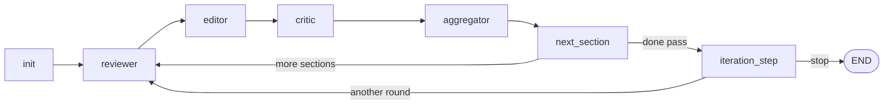

# paper-reviewer

[](https://www.python.org/downloads/)

**paper-reviewer** is a small [LangGraph](https://github.com/langchain-ai/langgraph) demo that iteratively reviews and refines **LaTeX** manuscripts **one `\section{...}` block at a time**. Three LLM roles (**Reviewer → Editor → Critic**) propose edits and scores; an **aggregator** accepts changes only when the critic’s score improves the last accepted score for that section, otherwise it **rolls back**.

Chinese documentation: **[README_zh.md](README_zh.md)**.

---

## Table of contents

- [Features](#features)
- [Architecture](#architecture)
- [Requirements](#requirements)
- [Installation](#installation)
- [Quick start](#quick-start)
- [Configuration](#configuration)
- [CLI](#cli)
- [Edit modes (proofread vs rewrite)](#edit-modes-proofread-vs-rewrite)
- [Iteration semantics](#iteration-semantics)
- [LLM backends](#llm-backends)
- [Logging and exit codes](#logging-and-exit-codes)
- [Development](#development)
- [Troubleshooting](#troubleshooting)

---

## Features

- **Section-aware pipeline**: parses `\section` / `\subsection` hierarchy, processes sections in document order.
- **Multi-role graph**: Reviewer (issues) → Editor (refined LaTeX) → Critic (0–1 score) → Aggregator (accept / rollback).
- **Outer iterations**: configurable max full-document passes and per-section “no improvement” limits.
- **OpenAI-compatible API** by default (e.g. local [Ollama](https://ollama.com/) `/v1`), plus optional **Ollama native** backend for models that need thinking disabled (e.g. Qwen3.5).
- **Document prefix**: text before the first `\section` (preamble, title, abstract) is stored in `GraphState.document_prefix` and prepended when writing output; section bodies remain graph-internal.
- **Literal `\n` cleanup**: after each editor JSON parse, a conservative pass converts spurious two-character `\`+`n` sequences into real newlines without eating `\neq`, `\nabla`, `\newcommand`, etc.
- **Optional chained pass**: `--post-proofread` (or YAML `post_proofread_after_rewrite`) runs a second graph in `proofread` mode after `rewrite` (extra LLM cost; `post_proofread_max_iterations` caps the second pass).
- **CLI + YAML** with clear precedence; file logging; optional Ollama health probe before the run.
- **Tests** (pytest) and **ruff** for linting.

---

## Architecture



- **`LangGraph_loop_llm.py`**: compiled graph using `*_llm` nodes (production path for `run.py`).
- **`LangGraph_loop.py`**: same topology with **mock** nodes (used by `run_demo.py` and tests).
- **`langgraph_state.py`**: Pydantic models for `GraphState`, sections, issues, and history.
- **`langgraph_nodes.py`**: all node implementations, LLM wiring, and `init_llms_from_config`.
- **`paper_reviewer_tool.py`**: LaTeX splitting (`split_prefix_and_sections`), `render_sections`, `assemble_output_tex`, and `normalize_fake_newlines_in_latex`.
- **`prompt_modes.py`**: built-in system prompts per mode/role and merge with optional YAML `modes` overrides.

---

## Requirements

- **Python 3.10+**
- For **`run.py`**: a running **OpenAI-compatible** server (typically Ollama) and pulled models as configured.
- For **`run_demo.py`**: no LLM required.

---

## Installation

```bash
git clone <your-repository-url>
cd paper_reviewer
python -m venv .venv
```

**Windows (PowerShell):** `.\.venv\Scripts\Activate.ps1`  
**macOS / Linux:** `source .venv/bin/activate`

Install dependencies (pick one):

```bash
# Reproducible pins (recommended)
python -m pip install -r requirements-lock.txt

# Loose package names only
python -m pip install -r requirements.txt
```

If you use **`llm.backend: ollama_native`** in YAML, also install:

```bash
python -m pip install langchain-ollama
```

Copy and edit config:

```bash
copy config\local.example.yaml config\local.yaml   # Windows
# cp config/local.example.yaml config/local.yaml    # Unix
```

Do **not** commit real cloud API keys. Use `api_key: ollama` for local Ollama, or put secrets in `config/*.private.yaml` (gitignored).

---

## Quick start

**Mock pipeline (no LLM):**

```bash
python run_demo.py
```

**Full LLM pipeline:**

```bash
python run.py --input sample_manuscript.tex --output output.tex
```

**Developmental polish (rewrite):**

```bash
python run.py --input sample_manuscript.tex --output draft.tex --mode rewrite
```

**Two-phase workflow (separate runs, separate logs):** run once with `--mode rewrite`, then after human edits run again with `--mode proofread` using the previous `.tex` as `--input`. Each invocation has its own in-memory `history` and log file. **Alternatively**, a single `run.py` can chain with `--mode rewrite --post-proofread` (second pass in-process, still a fresh `GraphState` for the proofread leg).

Print version:

```bash
python run.py --version
```

---

## Configuration

Default file: **`config/local.yaml`**. Override path with `--config`.

| Key | Purpose |
|-----|--------|
| `input_path` / `output_path` | Default TeX input / output paths |
| `mode` | `proofread` (default) or `rewrite`; selects reviewer/editor/critic system prompts for this run |
| `modes` | Optional map: `modes.<proofread\|rewrite>.<reviewer\|editor\|critic>` strings override built-in prompts |
| `post_proofread_after_rewrite` | If `true` and `mode` is `rewrite`, `run.py` runs a second pass in `proofread` (also enable with CLI `--post-proofread`) |
| `post_proofread_max_iterations` | Outer iteration cap for the optional second `proofread` pass (default `1`) |
| `max_iterations` | Maximum **outer** full-document passes |
| `max_no_improve` | Per-section streak cap without beating the best accepted score → section skipped |
| `log_level` | `DEBUG` / `INFO` / `WARNING` / `ERROR` |
| `log_dir` | Directory for timestamped log files |
| `ollama_healthcheck` | If `true`, `run.py` probes `{host}/api/tags` (disable for non-Ollama hosts) |
| `llm` | `backend`, `base_url`, `api_key`, optional `request_timeout`, per-role `model` / `temperature` |

See **`config/local.example.yaml`** for commented examples (including `ollama_native` vs `openai_compatible`).

**Precedence:** CLI arguments override YAML where supported; YAML overrides built-in defaults in `runtime_config.DEFAULT_CONFIG`.

---

## CLI

| Argument | Description |
|----------|-------------|
| `--input` | Input `.tex` path |
| `--output` | Output `.tex` path |
| `--config` | YAML config path (default `config/local.yaml`) |
| `--max-iterations` | Outer iteration cap |
| `--max-no-improve` | Per-section no-improve cap |
| `--log-level` | Logging level |
| `--mode` | `proofread` or `rewrite`; overrides YAML `mode` |
| `--post-proofread` | After `rewrite`, run an automatic second pass in `proofread` (sets `post_proofread_after_rewrite` for this run) |
| `--allow-llm-failures` | Exit `0` even if LLM calls failed (default: exit `1` when failures occurred) |
| `--version` | Show version |

---

## Edit modes (proofread vs rewrite)

| Mode | Intent |
|------|--------|
| `proofread` | Minimal edits guided by reviewer issues and spans; critic rewards small, safe improvements. **Default** — matches the original project behaviour. |
| `rewrite` | Broader sentence- and paragraph-level polish (clarity, cohesion, terminology); still forbids inventing data, changing conclusions, or stripping `\cite`/`\ref`/`\label` and math environments. Critic rubric matches this goal. |

**OpenAI-compatible and `ollama_native` paths** both use the same prompt set for the resolved mode. `run.py` logs `mode=...` at startup and LLM nodes log `mode=...` on invoke.

**Precedence:** `--mode` CLI > YAML `mode` > built-in default `proofread`.

---

## Iteration semantics

1. **Section loop**: For each parsed section, in order: Reviewer → Editor → Critic → Aggregator, then advance to the next section.
2. **Aggregator**: Compares the new critic score to the **last accepted** score for that `section_id`.
   - **Higher** → accept, append to `history`, update `best_tex`.
   - **Otherwise** → rollback that section’s body to the last accepted content.
   - If there is no prior accepted score, the baseline is `0.0`.
3. **Per-section skip**: If a section fails to improve for `max_no_improve` consecutive tries, it is skipped for the rest of the run (see `skipped_section_ids` in state).
4. **Outer stop**: After a full pass, `iteration_step` may start another outer round until `max_iterations` or early-stop rules (e.g. no document-wide improvement) apply.

There is **no single global “best score”** across sections in the summary; scores are reported **per section** to avoid mixing incomparable values.

---

## LLM backends

| `llm.backend` | When to use |
|---------------|-------------|
| `openai_compatible` (default) | Any OpenAI-style `/v1` API: Ollama, vLLM, cloud providers, etc. Uses `langchain-openai` `ChatOpenAI` + structured output. |
| `ollama_native` | Ollama with native options (e.g. disable thinking for Qwen3.5). Requires `langchain-ollama`. Uses JSON parsing with limited retries for long LaTeX in `refined_latex`. |

---

## Logging and exit codes

- Logs go to the console and to `log_dir` (default `logs/`), files like `run_<timestamp>.log`.
- If any LLM node raises, `llm_failure_count` increments. **`run.py` still writes the output TeX** but exits with code **`1`** by default so automation does not treat a degraded run as success. Use `--allow-llm-failures` only when you explicitly want exit code `0`.

Editor JSON parse warnings (e.g. malformed or truncated JSON from the model) are retried up to three times before failing the node.

---

## Development

```bash
python -m pytest -q
python -m ruff check .
```

Beginner-oriented testing notes (Chinese): **`TESTING_GUIDE_ZH.md`**.

**VS Code / Cursor:** `.vscode/launch.json` and `.vscode/tasks.json` include demo, tests, and ruff tasks. Adjust the Python interpreter path to match your environment.

---

## Troubleshooting

| Symptom | What to try |
|---------|-------------|
| `ModuleNotFoundError` | Install from `requirements-lock.txt` or `requirements.txt`; add `langchain-ollama` for `ollama_native`. |
| `502` or connection errors to `localhost` | Use `http://127.0.0.1:11434/v1` in `llm.base_url` or bypass proxy for local addresses. |
| Frequent `Retrying request` / timeouts | Set a larger positive `llm.request_timeout` in YAML, or remove it if too aggressive. |
| Truncated TeX in terminal | Open the output file; the CLI only prints a preview. |
| JSON parse warnings on Editor | Long sections: increase model context / `num_predict`, simplify prompts, or use a model that follows JSON more reliably. |

---

## Version

`python run.py --version` should match `_version.py` and `pyproject.toml` `[project].version`; bump them together when releasing.
