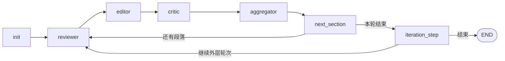

# paper-reviewer

[](https://www.python.org/downloads/)

**paper-reviewer** 是一个基于 [LangGraph](https://github.com/langchain-ai/langgraph) 的示例项目：按 LaTeX 中的 **`\section{...}`（及子节）** 将手稿切块，通过 **Reviewer → Editor → Critic** 三个 LLM 角色迭代审稿与润色，再由 **Aggregator** 根据 Critic 打分决定 **采纳或回滚** 到该段上次已采纳版本。

英文文档：**[README.md](README.md)**。

---

## 目录

- [功能概览](#功能概览)
- [架构说明](#架构说明)
- [环境要求](#环境要求)
- [安装](#安装)
- [快速开始](#快速开始)
- [配置说明](#配置说明)
- [命令行参数](#命令行参数)
- [编辑模式（订正 / 重写）](#编辑模式订正--重写)
- [迭代与打分语义](#迭代与打分语义)
- [LLM 后端](#llm-后端)
- [日志与退出码](#日志与退出码)
- [开发与测试](#开发与测试)
- [常见问题](#常见问题)

---

## 功能概览

- **按节解析**：识别 `\section` / `\subsection` 层次，按文档顺序逐节处理。
- **多节点工作流**：审稿（问题列表）→ 改写（结构化 LaTeX）→ 打分（0–1）→ 聚合（采纳 / 回滚）。
- **外层迭代**：可配置整稿最多跑几轮、单节连续无提升上限。
- **默认 OpenAI 兼容接口**（如本机 [Ollama](https://ollama.com/) `/v1`）；可选 **Ollama 原生**后端，便于关闭 thinking 等（如 Qwen3.5）。
- **编辑模式**：`proofread`（最小必要修改、按 span 订正）与 `rewrite`（发展性润色：句式与衔接、术语统一等，仍禁止编造数据或破坏 LaTeX/引用）。通过 `--mode` 或 YAML `mode` 每次运行选一种；可在 `modes` 下按角色覆盖内置 system 文案。
- **YAML + CLI**、文件日志、可选 Ollama 启动前健康检查；**pytest** 与 **ruff** 纳入工作流。

---

## 架构说明



| 模块 | 作用 |
|------|------|
| `LangGraph_loop_llm.py` | 编译 LLM 版图（`run.py` 使用） |
| `LangGraph_loop.py` | 同拓扑的 Mock 节点图（`run_demo.py`、测试） |
| `langgraph_state.py` | `GraphState`、段落、问题、历史等 Pydantic 模型 |
| `langgraph_nodes.py` | 各节点实现、`init_llms_from_config` |
| `paper_reviewer_tool.py` | TeX 切分与回写渲染 |
| `prompt_modes.py` | 各模式内置 system 文案及 YAML `modes` 合并 |

---

## 环境要求

- **Python 3.10+**
- 运行 **`run.py`**：需可用的 **OpenAI 兼容**服务（通常为 Ollama），并已拉取配置中的模型。
- 运行 **`run_demo.py`**：无需 LLM。

---

## 安装

```bash
git clone <your-repository-url>
cd paper_reviewer
python -m venv .venv
```

**Windows（PowerShell）：** `.\.venv\Scripts\Activate.ps1`  
**macOS / Linux：** `source .venv/bin/activate`

安装依赖（二选一）：

```bash
# 推荐：锁定版本
python -m pip install -r requirements-lock.txt

# 或仅包名
python -m pip install -r requirements.txt
```

若配置中使用 **`llm.backend: ollama_native`**，需额外安装：

```bash
python -m pip install langchain-ollama
```

复制配置模板：

```bash
copy config\local.example.yaml config\local.yaml   # Windows
# cp config/local.example.yaml config/local.yaml   # Unix
```

**不要**将云端真实 API Key 提交到仓库；本机 Ollama 可使用 `api_key: ollama`。敏感项可放在 **`config/*.private.yaml`**（已在 `.gitignore` 中忽略）。

---

## 快速开始

**Mock（无 LLM）：**

```bash
python run_demo.py
```

**完整 LLM 流水线：**

```bash
python run.py --input sample_manuscript.tex --output output.tex
```

**发展性润色（重写模式）：**

```bash
python run.py --input sample_manuscript.tex --output draft.tex --mode rewrite
```

**两阶段工作流（两次独立进程、两份独立日志）：** 第一次用 `--mode rewrite` 得到一版 `.tex`，经导师或合作者人工修改后，第二次将上一版作为 `--input`，并用 `--mode proofread` 做终稿式订正。每次运行的 `history` 仅在当次内存中，不会跨 run 混淆。

查看版本：

```bash
python run.py --version
```

---

## 配置说明

默认读取 **`config/local.yaml`**，可用 `--config` 指定其他路径。

| 配置项 | 含义 |
|--------|------|
| `input_path` / `output_path` | 默认输入 / 输出 TeX 路径 |
| `mode` | `proofread`（默认）或 `rewrite`；决定本 run 三角色 system 提示词 |
| `modes` | 可选：在 `modes.<proofread\|rewrite>.<reviewer\|editor\|critic>` 覆盖对应内置文案 |
| `max_iterations` | 外层「整稿轮次」上限 |
| `max_no_improve` | 单节连续未超过历史已采纳分时，达到该次数后跳过该节 |
| `log_level` | 日志级别 |
| `log_dir` | 日志目录 |
| `ollama_healthcheck` | 为 `true` 时 `run.py` 启动前探测 `{主机}/api/tags`；非 Ollama 端点请改为 `false` |
| `llm` | `backend`、`base_url`、`api_key`、可选 `request_timeout`、各角色 `model` / `temperature` |

字段说明与示例见 **`config/local.example.yaml`**。

**优先级：** 命令行可覆盖项 **优于** YAML **优于** `runtime_config.DEFAULT_CONFIG` 中的默认值。

---

## 命令行参数

| 参数 | 说明 |
|------|------|
| `--input` | 输入 `.tex` 路径 |
| `--output` | 输出 `.tex` 路径 |
| `--config` | YAML 配置路径 |
| `--max-iterations` | 外层迭代上限 |
| `--max-no-improve` | 单节无提升次数上限 |
| `--log-level` | 日志级别 |
| `--mode` | `proofread` 或 `rewrite`，覆盖 YAML 中的 `mode` |
| `--allow-llm-failures` | LLM 出错时仍返回退出码 0（默认：有错则退出码 1） |
| `--version` | 打印版本 |

---

## 编辑模式（订正 / 重写）

| 模式 | 说明 |
|------|------|
| `proofread` | 以审稿问题与 span 为牵引做**最小必要修改**；Critic 按「小改动下是否改善」打分。**默认**，与项目原有行为一致。 |
| `rewrite` | 允许在整段内**重组句式、加强衔接、统一术语**；禁止虚构实验/数据/结论，禁止删除或破坏 `\cite`、`\ref`、`\label` 及数学环境；Critic 的评分标准与此一致。 |

**OpenAI 兼容**与 **`ollama_native`** 两条后端均使用当前模式下的同一套文案；`run.py` 启动日志与各 LLM 节点调用日志中会带 `mode=...`。

**优先级：** 命令行 `--mode` **优于** YAML `mode` **优于** 内置默认 `proofread`。

---

## 迭代与打分语义

1. **节内循环**：对每个解析出的节依次执行 Reviewer → Editor → Critic → Aggregator，再进入下一节。
2. **Aggregator**：将本轮 Critic 分数与该节 **上次已采纳分** 比较。
   - **更高** → 采纳，写入历史，更新全文快照 `best_tex`。
   - **否则** → 将该节内容回滚到上次采纳版本。
   - 若尚无已采纳分，基线为 `0.0`。
3. **跳过节**：连续 `max_no_improve` 次未超过该节历史最优则标记跳过（见状态中 `skipped_section_ids`）。
4. **外层停止**：每完成一整轮全文章节后，由 `iteration_step` 与路由逻辑判断是否再开下一轮，直到达到 `max_iterations` 或触发提前结束条件（例如整轮无任何采纳）。

结束时的分数摘要为 **各节最新已采纳分**，**不使用**单一全局「best score」跨节混排，以免误导。

---

## LLM 后端

| `llm.backend` | 适用场景 |
|---------------|----------|
| `openai_compatible`（默认） | 任意 OpenAI 风格 `/v1`：Ollama、vLLM、云端等；使用 `langchain-openai` 与结构化输出。 |
| `ollama_native` | 需原生参数（如关闭 Qwen3.5 thinking）时；依赖 `langchain-ollama`；Editor 对长 LaTeX 的 JSON 带有限次重试解析。 |

---

## 日志与退出码

- 日志同时输出到控制台与 `log_dir`（默认 `logs/`），文件名形如 `run_<时间戳>.log`。
- 任意 LLM 节点抛错会累计 `llm_failure_count`。**默认下 `run.py` 仍会写出当前输出 TeX，但进程以退出码 `1` 结束**，避免脚本误判为成功。仅在明确需要时使用 `--allow-llm-failures` 得到退出码 `0`。

Editor 若返回无法解析的 JSON（截断、引号未转义等），日志中可能出现 **WARNING**，内部会重试最多 3 次。

---

## 开发与测试

```bash
python -m pytest -q
python -m ruff check .
```

新手向测试说明见 **`TESTING_GUIDE_ZH.md`**。

**VS Code / Cursor**：仓库含 `.vscode/launch.json` 与 `tasks.json`，请将其中 Python 解释器路径改为你本机环境。

---

## 常见问题

| 现象 | 处理建议 |
|------|----------|
| `ModuleNotFoundError` | 在已激活环境中安装 `requirements-lock.txt` 或 `requirements.txt`；`ollama_native` 需安装 `langchain-ollama`。 |
| 本机 Ollama 连接异常、502 | 将 `llm.base_url` 设为 `http://127.0.0.1:11434/v1`，或为本地地址配置代理例外。 |
| 请求频繁重试 / 超时 | 适当增大 YAML 中 `llm.request_timeout`，或去掉过小的超时设置。 |
| 终端里 TeX 被截断 | 完整结果在输出文件中；终端仅预览。 |
| Editor 多次 JSON 解析警告 | 大节内容时增大上下文或生成长度、换更守 JSON 约束的模型，或考虑拆分章节。 |

---

## 版本

`python run.py --version` 应与 `_version.py` 及 `pyproject.toml` 中 `[project].version` 一致；发版时请同步修改。
